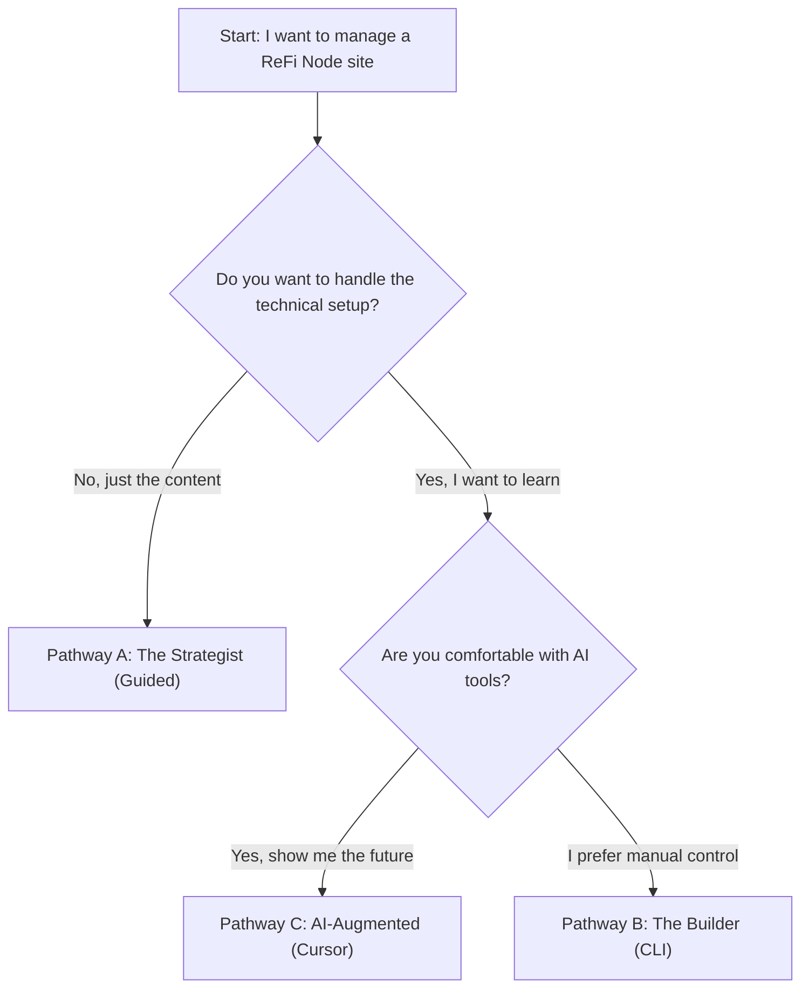
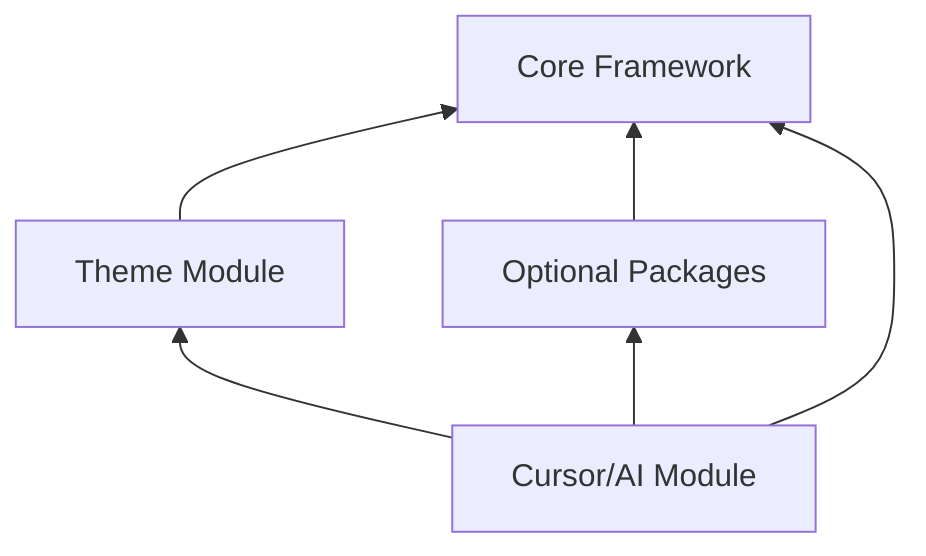
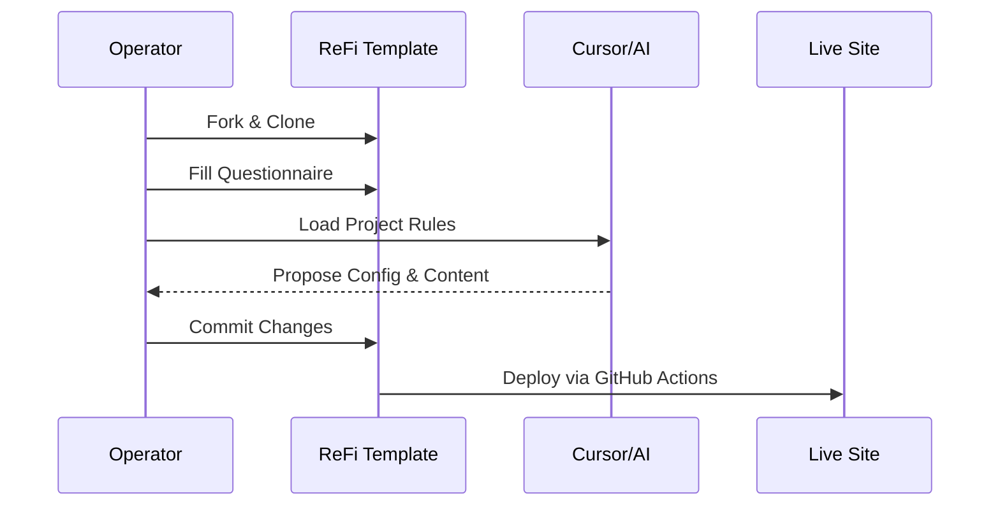

# ReFi Website Operator Guidebook

This guidebook is designed to help anyone—from strategic leaders to technical builders—operate and maintain a ReFi node website using the `quartz-refi-template`.

---

## 1. Choosing Your Pathway

Not everyone needs to be a developer to manage a website. We have defined three distinct pathways based on your comfort level with technology and the amount of support you have.

### The Scenario Matrix

| Scenario | Primary Tooling | Support Level | Best For |
|----------|-----------------|---------------|----------|
| **Pathway A: The Strategist** | GitHub Web Interface | Guided (Direct Support) | Leaders focused on mission, branding, and high-level content. |
| **Pathway B: The Builder** | Terminal / CLI + Git | Autonomous (Self-Serve) | Tech-curious operators who want full control over their site. |
| **Pathway C: AI-Augmented** | **Cursor / AI IDE** | Hybrid or Autonomous | Operators wanting maximum efficiency and AI assistance in development. |

### Pathway Selector Decision Tree

---

## 2. Pathway A: The Strategist (Guided)

**Your focus**: Vision, questionnaire, and high-level content.

1.  **Complete the Questionnaire**: Fill out `docs/QUESTIONNAIRE.md`. This is your blueprint.
2.  **Gather Assets**: Put your logos and images in the `assets/` folder.
3.  **Edit Content via GitHub Web**: You don't need to install anything. Navigate to `content/index.md` on GitHub.com and click the "Pencil" icon to edit.
4.  **Sync with Lead**: Your technical support person will handle the initial fork, package installation, and deployment configuration.

---

## 3. Pathway B: The Builder (Self-Serve)

**Your focus**: Implementation, customization, and deployment.

1.  **Local Setup**: Follow `docs/SETUP.md` to clone, install dependencies, and run the setup script.
2.  **Modular Development**: Use `npm run setup` to select only the packages you need (Analytics, Multilang, etc.).
3.  **Custom Styling**: Edit `quartz/styles/custom.scss` using the CSS variables defined in the theme.
4.  **Production Flow**: Use `npx quartz build --serve` to preview and Git to push changes to production.

---

## 4. Pathway C: AI-Augmented (Cursor)

**Your focus**: Rapid iteration and AI-assisted customization.

1.  **Use Cursor**: Open the project in [Cursor](https://cursor.sh).
2.  **Enable Cursor Rules**: Run `npm run setup:cursor`. This generates `.mdc` files that teach the AI about your specific site.
3.  **Chat with your Site**: Ask Cursor things like:
    *   "How do I change the primary color to forest green?"
    *   "Add a new section for 'Current Initiatives' to the homepage."
    *   "Help me translate this page into Catalan."
4.  **AI Modules**: Use the modular rules in `.cursorrules/` to guide the AI's behavior for specific tasks (styling vs. syncing).

---

## 5. "GitHub for Humans" Cheat Sheet

GitHub can be intimidating. Here is how to think about it in plain English:

*   **Repository (Repo)**: Your website's "Project Folder."
*   **Fork**: Making your own copy of the "Template" folder so you can change it without affecting others.
*   **Commit**: A "Save Point." Like saving a document, but with a note about what you changed.
*   **Push**: "Uploading" your saved changes from your computer to the internet (GitHub).
*   **Pull Request (PR)**: Asking to merge your improvements back into the main template for others to use.

---

## 6. The Modular Ecosystem

The template is built like a "Lego set" for ReFi websites.

### Module Dependency Map

### The Implementation Workflow

---

## 7. Next Steps

1.  Check the **Feature Library** at `docs/LIBRARY.md` to see what tools are available.
2.  If you have chosen **Pathway C**, make sure to read the specific AI guidance in `.cursorrules/README.md`.
3.  Start by completing the first 3 sections of the `docs/QUESTIONNAIRE.md`.

---
*Built with 💚 by the ReFi community.*

